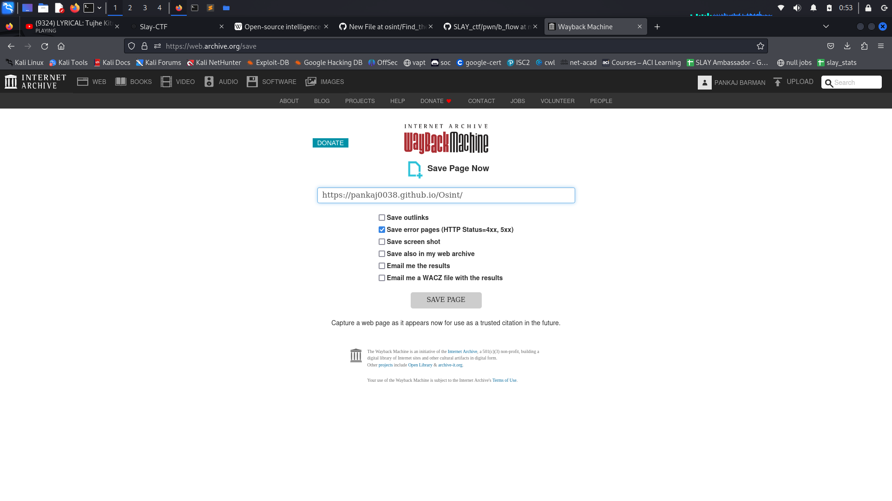
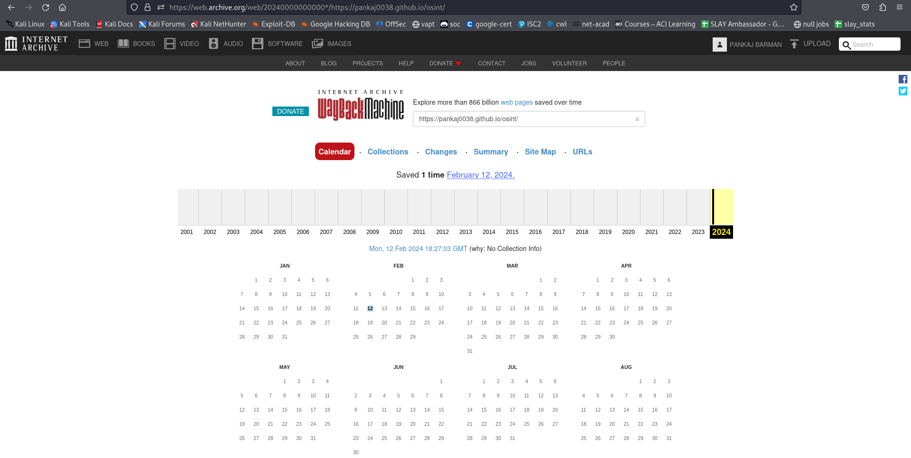
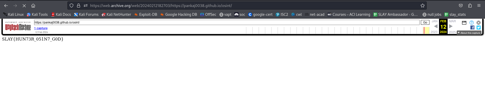

### Find_the_traces
---
#### Category: OSINT

---
<h4>Challenge:</h4> <i>@Pankaj0038</i>, on a secret mission to reveal the truth, shared a code on his website hosted in github but Gumn4m1 hacked it and deleted the website from internet, 
We got an secret message from underground spy that there is still some traces of that website,
Mission: Find the traces and get the code 

### How I created this challenge
---
  - To create this type of challenges first create a website with the flag 

    
  - Go to [Internet archieve](https://archive.org/) click on the web button on the top left

    
  - There you'll get a input section to save the snapshot of the page , put the url there and save 

       
  - Note that add ticks on the "save in my web archieve"
  - That's how I created the challenge

### Solution
---
  - To solve the challenge go to [Internet Archieve](https://archieve.org/) 

  - In the web section put the url and search

    
  - Then click on the date (hyperlinked the snapshot of the page)

      
  - And you get it flag : SLAY{HUN73R_051N7_G0D}
    
