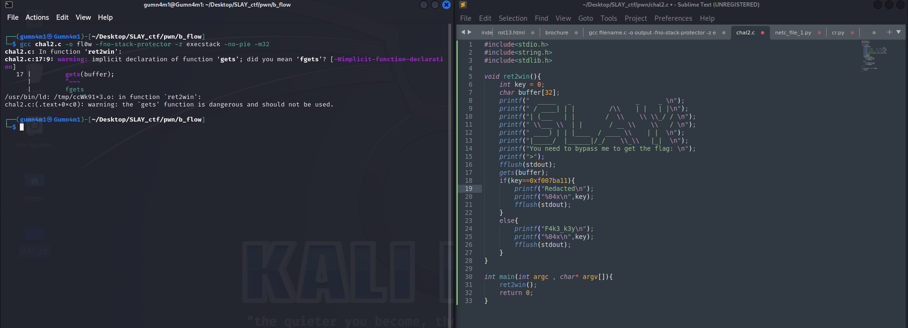

# b_flow
---
### Category : <i>Binary Exploitation</i>
---
#### Description
In this challenge a binary file "fl0w" will be provided to the user with a netcat command,
```(bash)
  nc <IP router provided> 6667 # ncat for windows
   ```
The binary file is created from the C program "chal2.c" which contains a vulnerability related to "buffer overflow"<p>

</p>
It uses "gets" function which can be exploited to get sensitive information

#### Create the binary file from the C code
```(bash)
gcc filename.c -o output -fno-stack-protector -z execstack -no-pie -m32
```

#### Run the challenge
1. Download the "b0flow" binary file which contains the flag
2. Download the "netc_file_1.py" in the same directory
3. Check your IP address : {IP}
   ```(bash)
   ipconfig # for Windows
   ```
   ```(bash)
   ifconfig # for Linux
   ```
4. Run the program "netc_file_1.py"
5. Provide the participants
   ```(bash)
   nc {IP} 6667
   ```

#### Solution
To solve the challenge the participants need to write the code "Solution.py" or need to input bytes data of ( 32 * "A" + "\x11\xba\x07\xf0" ) 
#### Flag
SLAY{Buff3r_bu573r_g33k}
